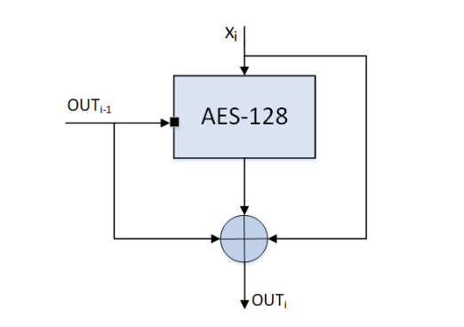

# 4 功能规格

## 介绍

安全硬件扩展 (SHE) 是对任何给定微控制器的片上扩展。 它旨在将对加密密钥的控制从软件域转移到硬件域，从而保护这些密钥免受软件攻击。 但是，它并不意味着要取代 TPM 芯片或智能卡等高度安全的解决方案，即规范不要求防篡改。

当前设计的主要目标是：

* 保护密钥免受软件攻击
* 提供真实的软件环境
* 让安全只取决于底层算法的强度和密钥的机密性
* 允许分布式密钥所有权
* 保持高灵活性和低成本

基本上，SHE 由三个构建块组成，一个用于保存密钥和其他相应信息的存储区域，一个分组密码 (AES) 的实现以及一个将这些部分连接到微控制器 CPU 的控制逻辑，请参见图 4.1 的简化框图。 SHE 可以通过多种方式实施，例如有限状态机或小型专用 CPU 内核。

<figure><figcaption><p>图 4.1：SHE 的简化逻辑结构</p></figcaption></figure>

本文档旨在提供 SHE 技术实现的详细描述，并将以参考实现作为补充。 本文档不包含每个单独要求的动机，也不包含如何在某些应用程序中使用 SHE 的概念。

请注意，SHE 不会通过简单地将其添加到微控制器来解决所有安全漏洞。 它必须得到应用软件和流程的支持。

### 约定

在接下来的章节中，有几段以斜体印刷。 这些段落并不是硬性要求，而是提供对基本机制的额外解释。

在整个文档中，术语“CPU”表示实际的微处理器，而“微控制器”用于描述硬件完整芯片，即 CPU 和所有包含的外围设备。 术语“控制逻辑”是指控制 SHE 内部算法和存储器的系统（例如有限状态机或小型微处理器）。

密码操作写为

$$
OUTPUT = OPERATION_{MODE,KEY[,IV]} (INPUT [, INPUT2, ...])
$$

此外，以下符号用于描述操作：

* ⊕ 按位异或
* \| 串联两个值（concatenation of two values）

每当描述到 CPU 的接口时，不暴露给 CPU 的 SHE 的内部存储器槽由它们的地址标识。 实际的密钥一般写为 KEY\_{KEY\_NAME}，而密钥的标识符则写为 ID\_{KEY\_NAME}。

所有值均以 MSB...LSB 的形式给出，即最高有效位/字节位于左侧。

形式给出的位序列

"0...0"128

应表示值为“0”且长度为 128 的位串。

## 基本要求

SHE 必须实现为微控制器的片上外围设备。 除了本文档中明确指定的那些之外，SHE 不得有任何其他连接。 如果必须包含额外的资源以确保在芯片制造期间正常运行，则所有端口都必须在物理上永久停用（如果可以通过外部引脚访问）。

SHE 可以通过多种方式连接到 CPU，例如通过专用接口或内部外围总线。 互连必须以其他外设或外部实体无法修改 CPU 和 SHE 之间传输的数据的方式实现。

SHE 不需要在特殊过程中制造以提高安全性，也不需要采取任何措施来加强系统抵御物理攻击，例如 蚀刻芯片外壳打开，差分功率分析，毛刺攻击。

注意：不需要复杂的安全硬件机制来满足 SHE 的规范。 但是，对于更高的安全要求，制造商当然可以加强设计以提供更高的安全级别。

每当用于调试软件和硬件的内部或外部调试器连接并处于活动状态时，SHE 都需要收到状态信号通知。 调试器的示例有 JTAG、BDM 等。

本文档仅描述 SHE 的技术部分。 过程和环境条件，例如用于插入 Key，不是本规范的主题。

## 算法

SHE 的所有加密操作均由 AES-128 [\[1\]](3-xiang-guan-wen-dang.md) 处理。 AES 的延迟必须保持 <2us 每次加密/解密单个块，包括密钥计划。

此外，AES 的性能必须足够高，以允许在 <10ms 内安全启动 5% 的闪存，但最小 32kByte 和最大 128kByte 的微控制器。

如果闪存比要求的慢，则闪存必须是安全启动的限制因素，并且必须在数据表中说明该限制。

### 加密/解密

对于数据的加密和解密，SHE 必须支持处理单块数据的电子密码本模式（ECB）和处理大量数据的密码块链接模式（CBC），详见 [\[2\]](3-xiang-guan-wen-dang.md)。

两种模式的延迟不得超过第 4.3 节开头给出的值

SHE 只能处理 AES 块长度的倍数，即所有必要的填充都必须由应用程序完成。

CPU 可能无法直接访问输入、输出和键输入以及任何中间结果，但必须根据 SHE 控制器逻辑的策略授予访问权限。

### MAC 生成/验证

MAC 生成和验证必须作为使用 AES-128 的 CMAC 实现，如 [\[3\]](3-xiang-guan-wen-dang.md) 所述。 有关更新示例，请参阅 [\[4\]](3-xiang-guan-wen-dang.md)。

### 压缩功能

使用 AES 作为块密码的 Miyaguchi-Preneel 构造（参见 [\[5\]](3-xiang-guan-wen-dang.md) 算法 9.43）用作 SHE 中的压缩函数。 在将消息提供给压缩算法之前必须对其进行预处理，即必须将它们填充并解析为 128 位块。

填充是通过将一个 “`1`” 位附加到位长为 `l` 的消息 `M`，然后是 `k` 个 “`0`” 位来完成的，其中 k 是方程 `l + 1 + k ≡ 88 mod 128` 的最小非负解 . 最后附加一个 `40` 位的块，该块等于使用无符号二进制表示形式表示的数字 `l`。

在将填充后的消息提供给压缩函数之前，必须将其解析为 `n` 个 128 位块 `x1`, `x2`, ..., `xn`。 值 OUT0 称为初始化向量 (IV)。

$$
AES-MP(x_i): OUT_i = ENC_{ECB},OUT_{i-1}(x_i) ⊕ x_i ⊕ OUT_{i-1}; i>0;
OUT_0= 0;
$$

<figure><figcaption><p>图 4.2：Miyaguchi-Preneel 单向压缩函数</p></figcaption></figure>

#### 关键推导

使用基于 [\[6\]](3-xiang-guan-wen-dang.md) 的 Miyaguchi-Preneel 压缩算法导出密钥。

派生密钥是通过压缩正确预处理的秘密 K 和常量 C' 的串联来计算的

```
C’ = 0x01 | counter | "SHE" | 0x00
```

请注意，第 4.12 节中给出的常数 C 已根据第 4.3.3 小节进行了填充。

```
KDF(K, C): AES-MP(K | C)
```

